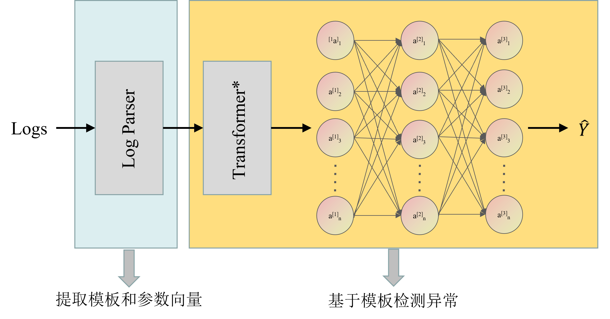
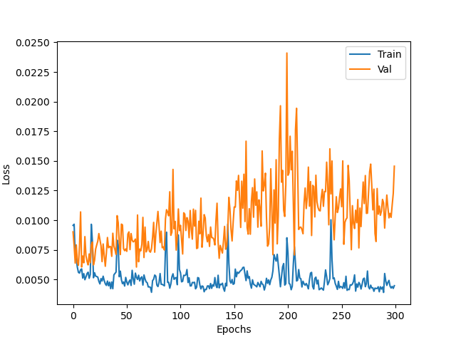

# Log-Anomaly-Detection
Based on the implementation of Deeplog, we introduced Transformer to improve the performance and proposed TransLog.

## Overall Architecture

## Experimental Results

## Usage
### Step 1: Create the Environment
pip install -r requirements.txt

### Step 2: Train
python train.py

### Step 3: Test
python test.py
